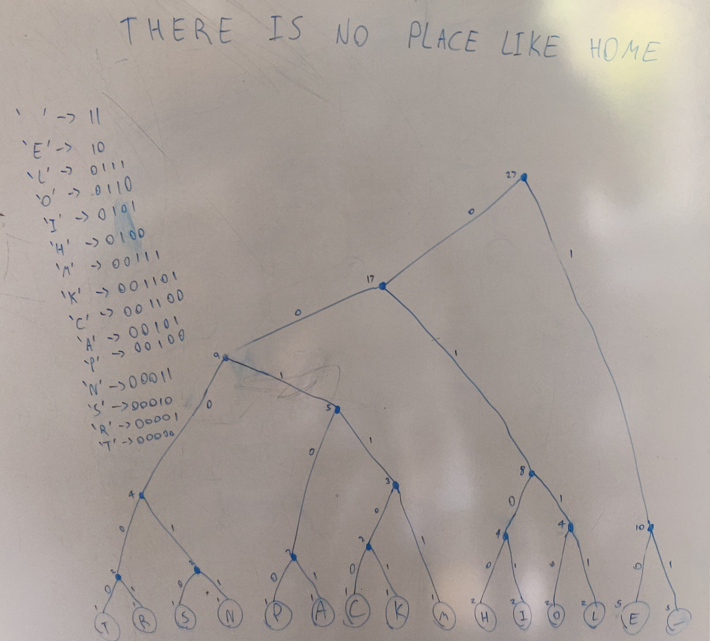

# Algorithm Analysis

### Task 1

Here is a hand drawn huffman tree used to minimize the encoding for the string "There is no place like home"

As you can see I have written the accumulated frequencies at each node in the tree.



You can see the character mapping in the photo but for clarity I will rewrite it here:

| Character | Bit Encoding |
|-----------|--------------|
| _         | 11           |
| E         | 10           |
| L         | 0111         |
| O         | 0110         |
| I         | 0101         |
| H         | 0100         |
| M         | 00111        |
| K         | 001101       |
| C         | 001100       |
| A         | 00101        |
| P         | 00100        |
| N         | 00011        |
| S         | 00010        |
| R         | 00001        |
| T         | 00000        |

Thus, "There is no place like home" would be encoded as
```
T 00000
H 0100
E 10
R 00001
E 10
  11
I 0101
S 00010
  11
N 00011
O 0110
  11
P 00100
L 0111
A 00101
C 001100
E 10
  11
H 0100
O 0110
M 00111
E 10
```

joined together this is
`000000100100000110110101000101100011011011001000111001010011001011010001100011110`
